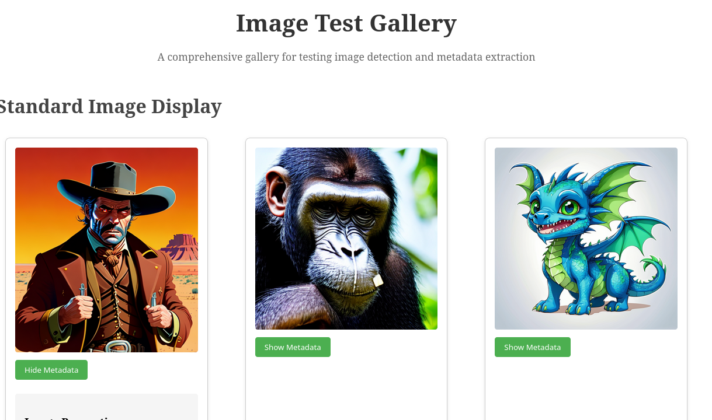

# zifr image exif metadata and AI prompt gallery

The purpose of this project is to produce a single page website that can be used to
 view the exif metadata of images, and view AI prompt metadata of images.

It includes images in various configurations, such as normal IMG, and images 
set in the background of a div, and images set as a CSS background image.

The github pages site is hosted at:

<https://tolland.github.io/zifr-test-gallery/>

